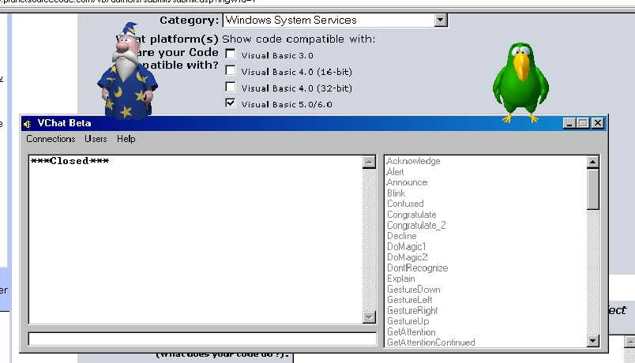



## The Microsoft Agent Control

### Description

Put 3d Helper Characters in your application with the Microsoft Agent Control. Just like the office assistant, you can make them talk, move, point, and more.
 
### More Info
 
Please make sure you have the MS-Agent Control and the character "Peedy". Download them from the microsoft web site. You will need the following files from the microsoft website at

http://msdn.microsoft.com/workshop/c-frame.htm#/workshop/imedia/agent/default.asp

+ Microsoft Agent Core Components

- Under Microsoft Agent Character Files: PEEDY

+ Text to Speech Engine

No Text to Speech if not installed.

             |
---                |---
**Submitted On**   |1998-09-30 09:04:32
**By**             |[hawk\_studios](https://github.com/Planet-Source-Code/PSCIndex/blob/master/ByAuthor/hawk-studios.md)
**Level**          |Intermediate
**User Rating**    |4.7 (42 globes from 9 users)
**Compatibility**  |VB 5\.0, VB 6\.0
**Category**       |[Windows System Services](https://github.com/Planet-Source-Code/PSCIndex/blob/master/ByCategory/windows-system-services__1-35.md)
**World**          |[Visual Basic](https://github.com/Planet-Source-Code/PSCIndex/blob/master/ByWorld/visual-basic.md)
**Archive File**   |[CODE\_UPLOAD6450652000\.zip](https://github.com/Planet-Source-Code/hawk-studios-the-microsoft-agent-control__1-8646/archive/master.zip)

### API Declarations

NONE!

